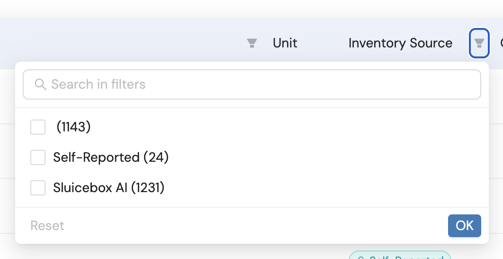

# Due Soon

Tasks that have an upcoming deadline or are important to complete soon.

(Claude Code moves tasks here automatically when deadlines get close.)

(Add tasks below this line.)

## Note all UX issues for the screens
- id: ux-issues-screens
- parent_id: none
- subtasks: ux-issues-product-analyzer
- status: open
- priority: none
- deadline: none
- target_date: 2026-01-17
- days_in_today: 0
- notes:

## Note UX issues for Product analyzer
- id: ux-issues-product-analyzer
- parent_id: ux-issues-screens
- subtasks: none
- status: open
- priority: none
- deadline: none
- target_date: 2026-01-17
- days_in_today: 0
- notes:
  - When filtering for Inventory Source it only filters the child items so a lot of parent items may have the other inventory source which is confusing
  - 
  - "Inventory Source" is a confusing term to start with

## Create ticket for LCA report improvements and large BOM issues
- id: lca-report-improvements-ticket
- parent_id: none
- subtasks: none
- status: open
- priority: none
- deadline: none
- target_date: 2026-01-17
- days_in_today: 0
- notes:
  - Original message from Piriya (11:09 AM):
  - "Product note; LCA reports are somewhat incomplete to immediately go into third party review - we do have conclusions section missing, references"
  - "For WD I have manually made some updates to send their reports to the third party reviewers, to satisfy their requirements, most of which would be good to have for all LCA reports"
  - "WD are expecting to have most of these updates automated in the product ... 'at some point' we said"
  - Key issues: Missing conclusions section, missing references, manual updates needed

## Create BUG for large BOM report download issues
- id: large-bom-report-bug
- parent_id: none
- subtasks: none
- status: open
- priority: none
- deadline: none
- target_date: 2026-01-17
- days_in_today: 0
- notes:
  - Original message from Piriya (11:10 AM):
  - "We currently have issues (might not finish downloading) for producing reports for large BOMs"
  - This is a BUG ticket
  - Reports for large BOMs might not finish downloading

## Organization select should only exist if customer is in multiple organizations
- id: org-select-conditional
- parent_id: none
- subtasks: none
- status: open
- priority: none
- deadline: none
- target_date: 2026-01-17
- days_in_today: 0
- notes:
  - Organization select dropdown should only show if a customer is in multiple organizations
  - This should be the case for only very few customers

## Product looks "meh" on small screens
- id: small-screen-appearance
- parent_id: none
- subtasks: none
- status: open
- priority: none
- deadline: none
- target_date: 2026-01-17
- days_in_today: 0
- notes:
  - Product appearance needs improvement on small screens
  - Responsive design issues

## Get rid of all acronyms in the product
- id: remove-acronyms
- parent_id: none
- subtasks: none
- status: open
- priority: none
- deadline: none
- target_date: 2026-01-17
- days_in_today: 0
- notes:
  - Product assumes knowledge that may not be there
  - Piriya is an expert, some customers may not know things as well
  - Replace acronyms with full terms or explanations
  - Awareness task - no hard deadline
